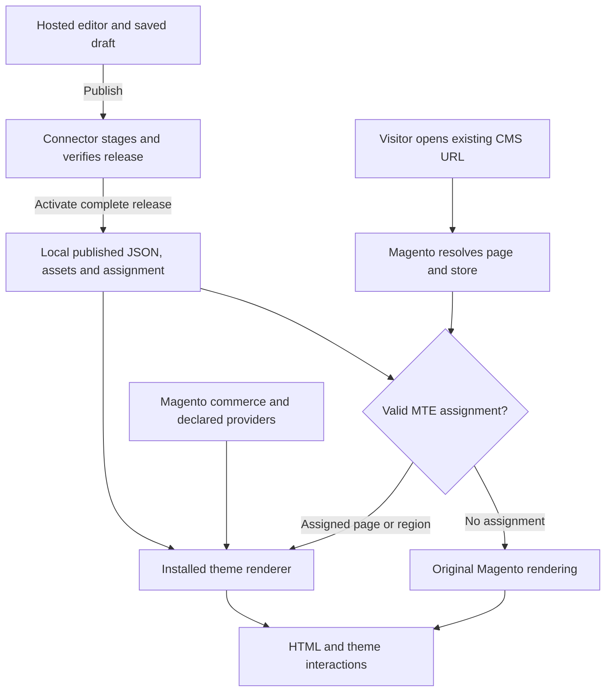

# CMS pages and storefront delivery

Status: **proposed production architecture, documented at the user's request on 10 September 2026**.
This records the recommended storage and delivery approach; it does not establish a completed
connector, public theme SDK or production availability guarantee. Existing full-page and hybrid
requirements remain binding. Implementation evidence is separated below.

## Recommended direction

Keep Magento as the owner of CMS page identity and commerce. Publish a theme package and its
structured content to the merchant's installation, where a generic connector selects the right
renderer for each assigned page and store view. Ordinary storefront requests should not need to
contact the editor service. The hosted editor remains the authoring and publishing application.

An existing CMS page can therefore retain its URL while displaying an MTE-authored full page.
Its design is stored as versioned sections, blocks, settings and references, rather than replacing
`cms_page.content` with the entire editor document or using an exported HTML string as the source
of truth. Preserve original content and rendering metadata for restoration.

This extends the [system boundaries](system-boundaries.md),
[full-page theme contract](full-page-theme.md) and
[hybrid assignment requirements](../requirements/hybrid-adoption.md).

## Storage and ownership

Magento already separates CMS page records from their store associations through `cms_page` and
`cms_page_store`. Its page record includes the identifier, title, content, enabled state and SEO
fields. These native entities should remain the source of truth for page identity and availability.
See the [Magento Open Source 2.4.6-p13 CMS schema](https://github.com/magento/magento2/blob/2.4.6-p13/app/code/Magento/Cms/etc/db_schema.xml).

The following division is proposed; module table names and storage schemas are not selected yet.

| Resource | Recommended owner and location |
| --- | --- |
| CMS identity, URL key, title, SEO metadata and enabled state | Native `cms_page`, accessed through Magento services |
| Native page-to-store associations | `cms_page_store`; MTE must respect effective store availability |
| Original HTML or Page Builder content | Preserve `cms_page.content`; retain a restoration reference for original content and layout metadata |
| Renderer assignment | Module-owned database records linking page ID and store scope to theme/template, rendering mode, compatible runtime, active release and restoration state |
| Published content | Immutable JSON release snapshots in durable merchant-controlled storage; a database record identifies the active snapshot |
| Shared resources | Versioned header/footer settings, menus and theme settings referenced by the release, with explicit affected-page scope |
| Theme implementation | Installed, versioned theme templates and registered component renderers, separate from editor application code |
| CSS, JavaScript, fonts and media | Versioned store-hosted assets by default; optional CDN delivery with a separately stated availability dependency |
| Drafts, collaboration and editing history | Hosted editor services in the intended product; a saved draft does not change public rendering |
| Catalog, prices, stock, customer context and cart | Magento services at runtime; design JSON holds references, not authoritative commerce snapshots |

Published snapshots are authoritative for what the store serves. Hosted drafts are authoritative
for ongoing editing; a failed publish must leave the store on its previous release. The editor
should display the store's acknowledged active release instead of assuming that a transfer succeeded.

Keep release manifests and assignment state outside disposable `pub/static` output. Source assets
or durable release storage must be sufficient to recreate static delivery after a deployment or
cache cleanup. A multi-node store needs all serving nodes to access the same complete release before
activation; a file written to one web node is insufficient. The precise database/blob-store split,
backup policy and storage adapter remain implementation decisions.

Magento remains the metadata authority. Any future editor controls that change native title, SEO
fields or availability must use explicit Magento updates with conflict handling, rather than silently
creating a second conflicting metadata source. Theme head output must preserve applicable native
metadata while avoiding duplicate tags.

## Existing CMS page adoption

For an existing `/about-us` page, the proposed merchant workflow is:

1. Open the page in Magento and choose an MTE editing action, or select the existing page from the
   editor. Display its store scope, current renderer and original-content restoration option.
2. Choose a compatible theme template and either full-page ownership or a supported content region.
3. Edit a draft and preview it in the intended store context. The public page remains unchanged.
4. Publish the selected assignment. Transfer and validate its complete release before activating it.
5. Continue serving the existing URL through Magento, now using the assigned theme renderer.

The proposed admin action and general page selector are not currently implemented. For a new page,
the connector would create a native CMS record through Magento services and link the assignment to
that record; it should not create an unrelated parallel URL system. The configured CMS homepage
should use the same entity-based assignment approach, including its `/` entry route.

Magento supports extending and overriding layouts for page rendering. Use supported extension
points in the connector and theme rather than editing core CMS files. Exact request/design/layout
hooks still require compatibility validation against supported versions and existing customizations.
See [Adobe's layout customization documentation](https://developer.adobe.com/commerce/frontend-core/guide/layouts/xml-manage).

## Public request and theme rendering

Selection must use the resolved page ID and store scope, with deterministic inheritance and
precedence. A raw URL alone is insufficient. Disabled pages, store restrictions, missing entities
and normal Magento responses must retain their native meaning; an MTE assignment must not bypass
those checks.

The installed theme renderer combines the published JSON with templates and live Magento/provider
data to produce HTML. The theme's assets supply shopper interactions; Alpine remains the default
theme interaction layer. The visitor does not load the React editor application to view the store.
Rendered HTML can be cached, but the structured document remains the editable source of truth.

Theme developers own templates, component schemas, appearance and declared interaction behavior.
The generic editor reads the supported contract to build controls, and the generic Magento connector
handles assignments and provider integration. A production theme must declare compatible native
renderers and capabilities; a browser-only preview renderer does not become Magento-compatible
merely by publishing its JSON. See [developer packages and current SDK limits](developer-packages.md).

## Full-page, hybrid and existing content

| Assignment mode | Owned surface |
| --- | --- |
| Full page | Theme-owned head, assets, announcement/header, navigation, template and footer for the selected page |
| Registered content region | Only the declared region; existing header, footer and surrounding theme remain responsible for their surfaces |
| Unassigned | Existing Magento renderer and content |

Reject overlapping full-page and region assignments until a supported precedence rule resolves
them. Shared header/footer/menu updates must disclose every affected page before publication.

Existing Page Builder markup, CMS blocks, widgets and custom templates do not automatically become
editable MTE sections. A conversion must identify supported structures, preserve originals and
report unsupported content. Native blocks/widgets can be exposed through explicit compatible
adapters where available; arbitrary directives or executable code must not be accepted as merchant
JSON. Unsupported content can remain on its original page or be rebuilt using theme sections.

## Publish, restore and availability

The proposed publication sequence is:

1. Validate document/component versions, theme capabilities, store-scoped references and assignment
   conflicts. Capture the expected current release to detect concurrent changes.
2. Assemble an immutable release manifest referencing the exact template/runtime versions, JSON and
   asset digests. Authenticate delivery and verify artifact integrity and provenance.
3. Stage every required artifact in merchant storage. Validate availability on all serving nodes;
   installing new executable theme/runtime code requires the package deployment process.
4. Atomically change the selected assignment to the complete release. Keep other assignments on
   their current releases unless a shared-resource change explicitly includes them.
5. Invalidate affected caches or change release-aware cache identities, verify the served release,
   and return an acknowledgement. Retain the previous valid release for rollback.

| Situation | Required target behavior |
| --- | --- |
| Save draft | Public page stays on its active release; previews remain authenticated and outside shared public caches |
| Transfer interrupted or artifact invalid | Keep the prior complete release active |
| Editor service unavailable | Continue rendering the last published release from merchant storage |
| Our CDN unavailable in store-hosted mode | Required local assets still load on a cold browser/server cache |
| CDN-only delivery selected | State its external dependency; a warm browser cache is not an outage guarantee |
| Active release becomes unreadable or incompatible | Recover a verified compatible prior release or the preserved original renderer; define and test the recovery policy explicitly |
| Merchant restores original page | Restore its content/layout ownership coherently without changing unrelated assignments or overwriting newer native edits silently |

Store-hosted mode must include required scripts, styles, fonts and media. Optional remote services
used by a theme still have their own dependencies and need declared degraded behavior. Subscription
expiry, export and uninstall retention remain separate policy decisions in the
[decision register](../decisions/index.md).

The runtime still depends on the installed connector and theme package. Hosting assets locally
does not install the proprietary editing services. Browser assets and delivered runtime/template
code remain inspectable; CDN delivery does not make that code confidential. Private editor and
publishing service logic stays outside the Magento distribution.

## Current implementation evidence

Source inspection on 10 September 2026 confirms the following bounded implementation. These are
workspace observations and links to existing evidence, not a new Magento runtime acceptance run.

| Area | Implemented scope and remaining limit |
| --- | --- |
| Silt full-theme persistence | `component-library/native/SiltFormDemo/Model/FullTheme/State.php` reads and writes `draft.json`, `active.json` and `previous.json` under Magento's `var/mte-full-theme`. This local state flow does not rewrite `cms_page.content` on each save. |
| Silt native selection | `Model/FullTheme/Context.php` selects fixed INOX store-1 demo routes; `Plugin/FullThemeDesign.php` and `Plugin/FullThemeBoundary.php` select the installed Silt theme/layout. This is not a general CMS-page assignment service. |
| Silt publication and cache behavior | The local apply operation activates a coherent full-theme snapshot. Independent per-page publication, production persistence, multi-node activation and FPC/CDN outage behavior are unfinished. Selected demo responses use private/no-store caching. |
| Daybreak | The local preset saves to `product/.local/theme-presets/daybreak.json`. It has no deployed Magento assignment or native commerce renderer. |

Read the [full-page architecture](full-page-theme.md),
[native commerce evidence](../roadmap/full-theme-commerce-evidence-2026-09-09.md),
[Daybreak delivery receipt](../design/theme-editor-uiux/daybreak-preset-2026-09-10.md) and
[execution plan](../roadmap/execution-plan.md) for their exact scopes and remaining work.

## Next implementation and acceptance work

This is a documentation plan, not a new execution batch or Linear task list.

1. Specify module-owned assignment/release storage, retention and backup rules, native metadata
   ownership, schema migrations, and the supported theme installation contract.
2. Implement store-scoped selection for an existing CMS page and configured homepage, including
   full-page ownership, original-content preservation and explicit restore behavior.
3. Implement authenticated preview and staged publication with concurrency checks, rollback and
   independent assignment updates. Show the effect of shared-resource changes before publishing.
4. Verify original and assigned pages across supported store views, URL changes, disabled pages,
   Page Builder content and declared widget/block/custom-theme adapters.
5. Prove warm/cold-cache rendering, failed transfer, loss of editor/CDN connectivity, static asset
   regeneration and multi-node activation for each supported delivery mode.

Use [HYB-01 through HYB-12](../requirements/hybrid-adoption.md#acceptance-criteria) as the existing
acceptance contract. Record source checks, local runtime results and browser acceptance separately.
When implementation is authorized, use the existing local Magento installations; this document does
not resume paused Magento work, authorize new environments or change release/commercial status.
