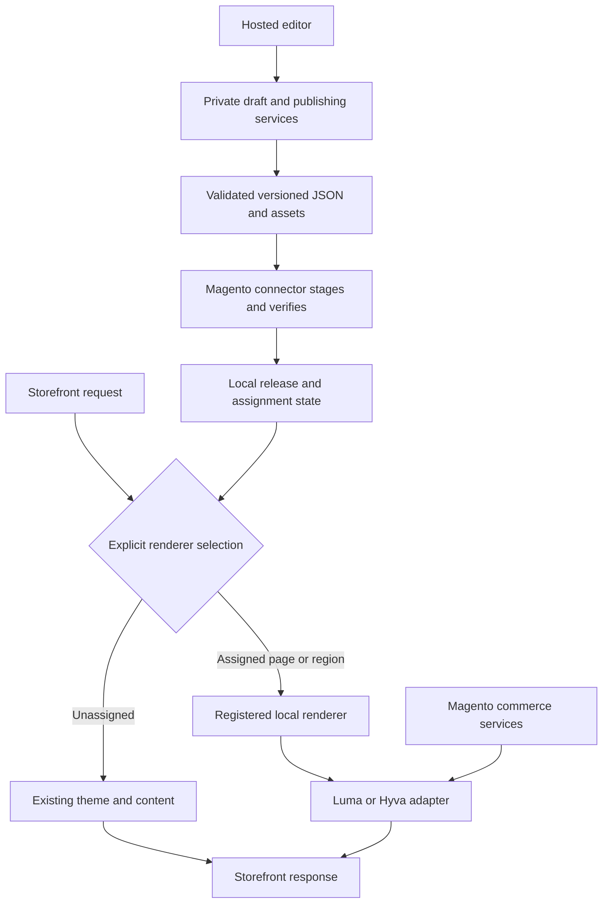

# System boundaries

## Current full-theme correction · 8 September 2026

The default theme must own selected pages from head to footer, with a parentless Magento layout,
Alpine CSP storefront assets independent of RequireJS, shared menus/settings and real native account
behavior. The optional hybrid region path remains separate. Read the [current architecture](full-page-theme.md)
and [native evidence](../roadmap/full-page-theme-evidence-2026-09-08.md); the research and earlier
bounded observations below are historical and do not define the final full-theme boundary.

The [CMS pages and storefront delivery proposal](cms-page-delivery.md), documented 10 September
2026, explains native CMS identity, separate MTE release storage, entity-based assignments,
store-hosted assets, publishing and outage behavior. It distinguishes the recommended production
design from the current fixed-route local implementation.

Status: recommended architecture to validate. Updated: 7 September 2026.
This summary derives from the [completed research](theme-editor-research-2026-09-07.md);
hybrid routing is clarified by the [local requirements](../requirements/hybrid-adoption.md).
Batch 01 adds an [executable contract and pure transition model](content-contract.md). The hosted
services and connector in this diagram remain unimplemented. Batch 02 supplies a local editor
concept; [Batch 03A](../roadmap/batch-03a-evidence-2026-09-07.md) verifies one fixture-only native
Luma home hero. [Batch 03B](../roadmap/batch-03b-evidence-2026-09-07.md) extends that fixed region to native hero/grid, live prices and simple/configurable guest cart proof. Full adapters, authenticated preview and publication remain unverified.

## Observed local boundary · Batch 03A

The unchanged portable content contract supplies a hero-only projection to an explicit local CLI
experiment. Magento selects one registered CMS-block region only on the mapped home/store/Luma
context, preserving the same block on an unassigned page and restoring native output when selection
is removed. The active bytes are revalidated and rendered through a fixed escaped template with
scoped CSS. The editor is not connected to this fixture.

Private local files are not the proposed release/signature/assignment protocol. There is no hosted
handshake, preview authentication, complete PHP validation parity, durable rollback,
multi-node activation or FPC/outage guarantee. These limits remain part of the planned responsibilities
below; the [fixture evidence](integration-fixtures.md#current-bounded-fixture-batch-03a) defines the
runtime combination and target. Batch 03B adds a bounded grid renderer with five fixture-native opaque mappings, current Magento pricing/salability, native cart forms and configurable PDP flow. The canonical contract and fixed region boundary remain unchanged; full adapter/publication responsibilities stay open.

## Responsibility contract

| Owner | Responsibility | Boundary |
| --- | --- | --- |
| Hosted editor and private services | Membership, drafts, schema controls, validation, preview coordination, release assembly/history | Confidential service logic and signing credentials stay here |
| Generic connector | Authenticated handshake, capability negotiation, staging, integrity checks, acknowledgement | Native installation and upgrade remain deployment work |
| Local runtime and assignments | Published documents, release pointers, deterministic page/region selection, registered components | No arbitrary remote code execution; drafts never become public by saving |
| Theme adapters | Correct templates, initialization, data providers, assets, cache behavior | Luma and Hyvä share semantic settings, not necessarily identical HTML |
| Magento | Catalog, customer context, prices, tax, inventory, cart, checkout, orders | Never freeze live commerce data into a design release |

The recommended implementation stack is recorded in the research. React/TypeScript, a private
Node API/worker, PostgreSQL, and object storage are proposals; providers and exact versions are
not provisioned or finalized here. The editor library must not own the portable content format.

## Versioned data and publication

The proposed contract includes schema/component versions, ordered sections and stable IDs,
bounded settings, asset manifests, required capabilities/runtime version, store-view inheritance,
explicit assignments, and immutable release identity. The research JSON example is illustrative,
not a complete schema or production API.

Publication must validate, stage, verify all required artifacts, activate atomically, invalidate
affected caches, and return store acknowledgement with verification. Independent page/region
publication must preserve other assignments. Restore content and renderer selection together.
See the [requirements](../requirements/hybrid-adoption.md#acceptance-criteria) for observable outcomes.

Preview uses the same Magento renderer and store context through authenticated, scoped requests.
Keep preview drafts and customer-specific content out of shared public caches. Treat supported
store, currency, customer-group, release, and assignment contexts explicitly in cache design.

## Asset and availability choices

Versioned immutable assets can use CDN delivery or a merchant-local mirror. Local-mode outage
proof requires all required assets and renderer behavior to work on a cold cache without the
editor service or its CDN. CDN-only assets have a distinct external availability dependency.

Keep authoritative publication state outside disposable static-deployment output. The exact
storage abstraction, signing lifecycle, multi-node activation, and cache strategy need a spike.
Browser bundles, delivered templates, and published output remain inspectable; hosting them
remotely is not source protection. These are research conclusions, not tested product guarantees.

## Decisions still needed

Finalize support versions, validate the [prototype precedence rules](content-contract.md#assignment-ownership-and-precedence), supported page/region combinations, theme
foundation licensing, persistence schemas, concurrency handling, storage/hosting selection, and
performance budgets. Track the status of each in the [decision register](../decisions/index.md).
