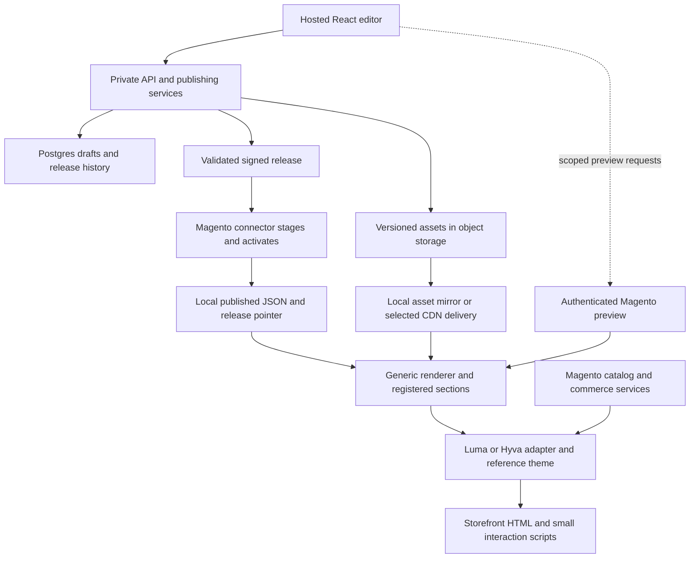

# MageThemeEditor: product research and architecture recommendation

Research date: 7 September 2026. Planning horizon: the next 6–12 months. Status: recommendation for validation, not an implemented or approved specification.

Owning project: `/Users/branorphiano/Projects/jobrandon/MageThemeEditor`. The directory was empty when inspected; there is no existing implementation to assess. This research uses public documentation, public issue reports, and community discussions. No customer interviews, private support records, or authenticated competitor workflows were examined. Product capabilities below are documented capabilities, not independent usability or performance measurements.

## Executive read

Build a hosted store-design product with a generic Magento connector and a free, compatible reference theme. Keep the editor, publishing orchestration, validation, and future automation services on your infrastructure, while Magento renders a locally stored published release. This gives the product its own technology stack and protects unshipped server-side logic without putting the editing service on every shopping request. The opportunity is broader than drag-and-drop content: merchants need predictable customization of a working store, and agencies need repeatable delivery across stores. Existing products already provide visual editing, JSON content, drafts, and history, so those features alone will not distinguish this product. Start with a narrow, well-supported theme and component contract, prove that merchants can publish safely without developers, and expand integrations using measured demand.

## What already exists

| Product | Observed capability | Implication for this product |
| --- | --- | --- |
| Magento Page Builder | Bundled with Magento Open Source since 2.4.3; uses an XHTML master storage format and Magento frontend/editor technologies. | A visual CMS is already available. A new product needs to simplify work beyond the existing content editor. |
| Hyvä CMS | Component JSON, local Magento template rendering, live preview, draft/publish, history, reusable templates, product/category attributes, and APIs. | The proposed JSON-component architecture has a close incumbent. |
| Breeze Theme Editor and Content Builder | Theme settings, store-view scope, drafts, rollback, presets, and a component editor for CMS pages. | Theme-wide visual settings are also an existing competitive category. |
| Builder.io | Its Magento plugin exposes product/category selection, targeting, and preview data for custom components. | Hosted visual composition connected to Magento is established; data integration alone is insufficient differentiation. |
| Shopify themes | JSON templates describe ordered sections and their settings; rendering lives in section templates. | Borrow the explicit theme contract and merchant workflow, rather than assuming a template language produces a complete commerce platform. |

Sources: [Magento 2.4.3 release notes](https://experienceleague.adobe.com/en/docs/commerce-operations/release/notes/magento-open-source/2-4-3), [Page Builder architecture](https://developer.adobe.com/commerce/frontend-core/page-builder/architecture/), [Hyvä CMS architecture](https://docs.hyva.io/hyva-commerce/features/cms/architecture-overview.html), [Hyvä CMS editor](https://docs.hyva.io/hyva-commerce/features/cms/editor.html), [Breeze Theme Editor](https://docs.swissuplabs.com/m2/extensions/breeze-theme-editor/), [Breeze Content Builder](https://docs.swissuplabs.com/m2/extensions/breeze-content-builder/content-builder/), [Builder Magento integration](https://www.builder.io/c/docs/plugins-ecom-magento), [Shopify JSON templates](https://shopify.dev/docs/storefronts/themes/architecture/templates/json-templates).

Hyvä Theme itself is now free and open source. Its commercial products, including Hyvä CMS through Hyvä Commerce, are separate. Hyvä distinguishes the default theme's dual OSL/AFL licensing from supporting modules' OSL licensing; a free foundation does not make every Hyvä product redistributable. Prefer original components and declared dependencies, and assess the actual files and licenses before distributing a derivative theme. [Hyvä product overview](https://docs.hyva.io/welcome/what-is-hyva.html), [Hyvä licensing guidance](https://www.hyva.io/hyva-theme-open-source-license).

The proposed positioning is a hypothesis: **one managed design workflow for Magento stores, with an explicit compatibility contract, reusable store designs, and verifiable publishing.** Interviews must establish whether merchants will pay for this over Hyvä CMS, Breeze, Page Builder, or an agency service. Neither cross-theme support nor fewer developers should be advertised as proven yet.

## Ranked user problems

Frequency signals below describe this small public sample. They are not prevalence estimates, and related bug reports are not counted as independent users.

| Rank / category | User goal and surface | What breaks and evidence | Severity / frequency / confidence | Recommended product move |
| --- | --- | --- | --- | --- |
| 1. Compatibility and developer friction | Customize a functioning storefront and keep existing extensions. Theme, product page, cart, and extension output. | Hyvä documents that Luma/Blank-based modules need compatibility implementations. Universal DOM editing cannot supply missing commerce behavior. | High impact; structural across affected integrations; high confidence in the constraint, unknown customer incidence. | Detect installed capabilities; support declared slots and adapters; show exactly what is editable. |
| 2. Preview and responsive reliability | Publish a campaign that works on mobile. Editor and live storefront. | Page Builder issue #907 reports a mobile banner/slider button disappearing with a mobile height setting. Related reports #898/#901 concern the same general mobile overlay problem. | High impact for affected calls to action; repeated related reports, not independent prevalence; medium confidence without reproduction. | Render previews through the production renderer and add mobile checks for important actions. |
| 3. Component customization and documentation friction | Add a common content pattern without commissioning substantial development. Component SDK and editor. | A 2025 discussion contains complaints about customization complexity and documentation. Adobe documents distinct preview and master templates. | Medium–high impact; several comments in one discussion plus architectural evidence; medium confidence, weak frequency estimate. | A small documented section schema, clear examples, sensible defaults, and a first-party library. |
| 4. Editor reliability and setup friction | Open and save content reliably. Admin editor, hosting security, rich text. | Issue #903 reports a source dialog outside the frame; #904 describes an inaccessible editor toggle and is closed with a linked fix. A 2025 Stack Overflow report describes an editor/Cloudflare Access interaction. | High when blocked; isolated environment-specific reports; medium confidence in historical failures, low confidence in present prevalence. | Compatibility diagnostics, robust autosave, recoverable drafts, and explicit blocked-publish states. Do not copy forum security workarounds. |
| 5. Migration and onboarding friction | Make an existing page editable. Existing HTML, Page Builder output, and theme settings. | A 2024 question expects Luma sample content to become visual blocks but sees HTML. Hyvä documents a Page Builder migration starting point. | Medium impact; limited anecdotal signal plus competitor response; medium confidence in migration need, low frequency confidence. | Import supported structures with a conversion report, preserve unsupported content, and keep a restore point. |

Evidence: [Hyvä compatibility](https://docs.hyva.io/hyva-themes/compatibility-modules/index.html), [mobile button report #907](https://github.com/magento/magento2-page-builder/issues/907), [Page Builder issue index](https://github.com/magento/magento2-page-builder/issues), [2025 developer discussion](https://www.reddit.com/r/Magento/comments/1obd6ov), [Adobe template architecture](https://developer.adobe.com/commerce/frontend-core/page-builder/content-types/create/add-templates), [dialog report #903](https://github.com/magento/magento2-page-builder/issues/903), [closed toggle report #904](https://github.com/magento/magento2-page-builder/issues/904), [hosting/editor report](https://stackoverflow.com/questions/79659418/magento-2-cloudaccess-admin-page-builder-stage-render), [existing Luma content question](https://magento.stackexchange.com/questions/373887/pagebuilder-luma-theme-blocks-show-up-as-html-only), [Hyvä migration entry](https://docs.hyva.io/hyva-commerce/features/cms/editor.html).

Billing pain, demand for an app marketplace, willingness to replace an existing theme, and willingness to pay for this SaaS were not established by this scan. Store locator and advanced reviews are proposed feature opportunities, not validated widespread complaints.

## Recommended system boundary



The graph is a proposed design. It is not evidence that the integration has already been built.

### Your SaaS owns

The editor application; account and store membership; field and component catalog management; draft history; design validation; release assembly; scheduling; publishing coordination; compatibility results; and future AI assistance. Keep confidential build transforms, automation logic, credentials, and signing keys here. Begin as a modular application plus a background worker, rather than many microservices.

### The Magento installation owns

A generic connector, local publication state, media references, a bounded renderer, theme adapters, and optional native data providers. Magento remains authoritative for catalog data, customer sessions, prices, tax, inventory, carts, checkout, orders, and native reviews. The editor can retrieve the minimum product/category data needed for selection and preview without replicating the whole commerce database.

Proposed package boundaries are `Vendor_EditorBridge`, `Vendor_EditorRuntime`, adapter packages for Luma and Hyvä, and an optional reference theme. A Composer metapackage can provide one installation entry point. These names are illustrative. The connector is a supported product surface that still needs secure upgrades, version negotiation, and diagnostics; generic does not mean trivial.

Initial installation and later native capability changes remain Magento deployment work. Normal theme settings and section composition should publish as data within the already-installed runtime's capabilities. A genuinely new renderer, database feature, or commerce hook can require a package update. Adobe's extension workflow documents Composer, module registration, and production compilation; Adobe's Admin UI SDK currently excludes Magento Open Source, so provide your own Admin launch action and authentication handshake. [Extension management](https://experienceleague.adobe.com/en/docs/commerce-operations/installation-guide/tutorials/extensions), [Admin UI SDK support boundary](https://developer.adobe.com/commerce/extensibility/admin-ui-sdk/installation).

## How to support Luma, Hyvä, and your own themes

| Offering | Promise | Boundary |
| --- | --- | --- |
| Your free compatible theme | Full control over supported tokens, navigation, header/footer variants, content sections, and supported page-template composition. | Every editable area is deliberately exposed by the theme contract. Checkout remains a separately tested integration. |
| Existing Hyvä theme | Edit registered sections and mapped theme settings, with a Hyvä-specific commerce adapter. | Existing overrides and third-party widgets are editable only when explicitly integrated. |
| Existing Luma theme | Edit registered content sections and mapped settings, with a Luma-specific adapter. | RequireJS/jQuery widgets and legacy theme CSS need their own integration and initialization rules. |
| Future headless storefront | Use the same semantic content model with an independently implemented renderer. | This is a separate storefront product and integration program. |

For the first reference theme, extending the free Hyvä foundation is the lowest-rebuild option. It keeps an established Magento storefront while the paid product remains your independent SaaS. If full storefront-framework independence is strategically essential, build an original theme later; that choice adds product listing, variant selection, cart, account, search, accessibility, and extension work that a theme editor does not eliminate.

The same JSON need not produce identical HTML in both themes. A product carousel has the same meaning and settings, but each adapter must use the correct price rendering, product URLs, customer context, add-to-cart behavior, JavaScript initialization, and cache identities. Use namespaced component CSS and design tokens; avoid global CSS resets or a second storefront-wide JavaScript framework.

## Technology stack

Selections are architectural recommendations for a small product team, not benchmark winners. Pin supported stable releases during the implementation spike.

| Layer | Recommended choice | Why it fits |
| --- | --- | --- |
| Hosted editor | React, TypeScript, Vite | A standalone interactive application, independent of Magento Admin UI implementation. |
| Section tree and interactions | dnd-kit, your own field panels and command model | Control the merchant workflow while leaving storefront rendering to Magento. Start with sidebar sorting and click-to-select before freeform dragging inside the preview. |
| Rich text | Tiptap core | Structured rich text limited to allowed marks and nodes; sanitize and render it consistently. Treat paid extensions as separate procurement choices. |
| Portable content contract | JSON Schema with Ajv; explicit schema migrations | Validate fields, nesting, limits, component versions, and releases. The PHP side must validate the same supported contract independently. |
| API | Node.js on a supported LTS line, TypeScript, Fastify | One main application language and a small API boundary for stores, drafts, components, and publishing. |
| Persistence | Managed PostgreSQL, JSONB, Drizzle | Relational tenancy/release metadata plus versioned component documents. Store order in arrays, not JSON object key order. |
| Background work | pg-boss with a separate Node worker | Publication, image jobs, retries, and scheduling using the existing database. External side effects still require idempotency and reconciliation. |
| Hosting | Render web service, background worker, and managed Postgres for the first deployment | A concrete managed deployment path that avoids running a cluster. Keep application packaging portable through Docker. |
| Assets | Cloudflare R2 with a production custom domain/CDN; local mirror supported | Versioned CSS/JS/images with either vendor-hosted or merchant-hosted delivery. Keep drafts private. |
| Magento runtime | PHP module, registered templates/blocks, minimal interaction JavaScript | Native server rendering and commerce reuse; the editor's React bundle is not needed by shoppers. |
| Verification | Playwright, PHP integration tests, TypeScript contract tests | Prove theme behavior, visual parity, cache isolation, lifecycle behavior, and release recovery. |

Tool references: [dnd-kit](https://dndkit.com/), [Tiptap](https://tiptap.dev/docs/editor/getting-started/overview), [Ajv schema choices](https://ajv.js.org/guide/schema-language), [Fastify](https://fastify.dev/docs/latest/), [PostgreSQL JSON types](https://www.postgresql.org/docs/current/datatype-json.html), [Drizzle PostgreSQL](https://orm.drizzle.team/docs/get-started-postgresql), [pg-boss](https://github.com/timgit/pg-boss), [Render service types](https://render.com/docs/service-types), [Render workers](https://render.com/docs/background-workers), [R2 delivery](https://developers.cloudflare.com/r2/buckets/public-buckets/), [Playwright visual comparisons](https://playwright.dev/docs/test-snapshots).

### Editor engines considered

| Option | Assessment |
| --- | --- |
| Custom React editor with dnd-kit | Recommended for the native Magento route. More editor work, but one real storefront rendering path and full control of the product contract. |
| Puck | Strong accelerator if you choose a React storefront. Its core is MIT and it uses React components, with a same-origin preview iframe. It is not a drop-in cross-origin editor for arbitrary Magento PHTML output; an adaptation spike would need to prove that fit. |
| GrapesJS | Useful for an HTML/template canvas and controlled landing-page authoring. Core is BSD-3-Clause. Preserve its JSON project data if adopted; exported HTML/CSS does not retain all editing information. Its Studio SDK is a separate offering. Magento commerce adapters remain your work. |
| Craft.js | MIT React building blocks for a highly custom editor; it does not supply a finished editor UI. Similar renderer-alignment issue to Puck for native Magento. |
| Builder.io | Useful as a benchmark or a purchased editing service. Its Magento data plugin does not by itself solve all storefront integration. Making an external commercial editor the core would introduce product, pricing, and embedding dependencies; verify terms before any white-label plan. |

Sources: [Puck](https://puckeditor.com/docs), [GrapesJS persistence](https://grapesjs.com/docs/modules/Storage.html), [GrapesJS license](https://github.com/GrapesJS/grapesjs/blob/dev/packages/core/LICENSE), [Craft.js](https://github.com/prevwong/craft.js/), [Builder Magento plugin](https://www.builder.io/c/docs/plugins-ecom-magento).

## JSON, templates, and Liquid

Adopt Shopify's distinction between the schema that defines controls, the saved section instances, and the templates that render them. Keep the product's document format independent of any editor library. An illustrative content document is:

```json
{
  "schemaVersion": 1,
  "theme": { "id": "starter", "version": "1.0.0" },
  "scope": { "storeView": "en", "template": "home" },
  "tokens": { "brandColor": "#173C32", "buttonRadius": "medium" },
  "sections": [
    {
      "id": "hero-1",
      "type": "hero",
      "version": 1,
      "settings": {
        "heading": "New arrivals",
        "image": { "assetId": "summer-hero", "alt": "Summer collection" },
        "alignment": "left"
      }
    },
    {
      "id": "products-1",
      "type": "product-grid",
      "version": 1,
      "settings": {
        "categoryId": 42,
        "limit": 8,
        "columns": { "mobile": 2, "desktop": 4 }
      }
    }
  ]
}
```

This is not a complete schema. Production also needs assignment rules, store-view inheritance, locale/currency context, schema/component migrations, asset manifests, a minimum runtime version, and immutable release identity. Define explicit inherit/reset/override behavior. Treat configurable products, price formatting, and inventory as live commerce data; do not bake them into a theme JSON release.

Use a fixed set of versioned, registered templates for the MVP. New presets and section arrangements can publish without code deployment; new template behavior may need a runtime release. This is simpler than immediately inventing a general-purpose template compiler.

Liquid can be a later theme-authoring option, particularly for a hosted renderer using LiquidJS. Liquid syntax alone does not supply Shopify objects, filters, commerce behavior, or theme compatibility. LiquidJS's limits are cooperative safeguards, not a full JavaScript/process sandbox. A PHP renderer could instead investigate Twig's sandbox, but maintaining both Liquid and Twig semantics would add a parity burden. Do not put both engines in the MVP. [Liquid variants](https://shopify.github.io/liquid/basics/variations/), [LiquidJS security model](https://liquidjs.com/tutorials/security-model.html), [Twig sandbox](https://twig.symfony.com/doc/3.x/sandbox.html).

## Publication, preview, and asset delivery

1. Save a draft in the SaaS under explicit store membership and editing permissions.
2. Preview through a scoped Magento endpoint using the same component renderer and store context as publication. Changes must not modify the public release.
3. Validate the document, component availability, asset references, and runtime compatibility. Assemble immutable JSON/CSS/JS assets and a signed release manifest.
4. Let the connector retrieve or receive the release over an authenticated channel. Stage files, verify signatures/hashes and allowed paths, and retain the prior release.
5. Activate a local release pointer only when all required artifacts are available. Invalidate affected Magento/Varnish content and verify the live result.
6. Report completion only after store acknowledgement and verification. A queued request is not a published release. Offer restoration of a compatible prior release.

Use a lightweight preview bridge with explicit `postMessage` origins, source validation, and bounded messages. Never give an iframe an unrestricted Magento Admin token. Account for `frame-ancestors`, cookie restrictions, and protected staging hosts; provide a top-level storefront preview when embedding is unavailable. Disable irreversible shopping actions in editing mode. [Browser cross-origin messaging guidance](https://developer.mozilla.org/en-US/docs/Web/API/Window/postMessage?lang=en).

Rendering and cache handling must separate public sections from private cart/customer content. Keep customer-specific data out of shared HTML and CDN assets. Include the necessary store, currency, customer-group, and release context in relevant cache behavior. Do not disable full-page caching globally to make the editor work. [Magento public content](https://developer.adobe.com/commerce/php/development/cache/page/public-content), [Magento page caching](https://developer.adobe.com/commerce/php/development/cache/page/).

For delivery, offer CDN-hosted and local-mirror modes. In local-mirror mode, publish-time acquisition of every required runtime asset allows the last release to run without the SaaS or its CDN; remote widgets remain separate dependencies. With CDN-only assets, an editor outage need not break shopping, but a CDN outage can. Make that distinction explicit.

Do not use `pub/static` as the only durable store for uploaded or generated releases: Magento's deployment procedure regenerates that area. Keep authoritative publication state in dedicated module tables and use a supported persistent asset store, such as a carefully restricted `pub/media/<vendor>/releases/<hash>/` location or the merchant's configured media backend. Permit only intended static file types, prevent PHP execution, and use Magento storage abstractions for remote/multi-node installations. If an enterprise requires `pub/static`, deliver reproducible assets through its deployment pipeline. [Magento static deployment](https://experienceleague.adobe.com/en/docs/commerce-operations/configuration-guide/cli/static-view/static-view-file-deployment).

Use content-addressed asset URLs instead of a mutable `latest.js`. CDN caches can continue serving overwritten objects, so immutable release URLs simplify consistency. Configure production R2 delivery through a custom domain; keep unpublished documents and signing material outside public buckets. Register the required script/style sources with Magento CSP and support strict configurations. [R2 cache consistency](https://developers.cloudflare.com/r2/reference/consistency/), [Magento CSP](https://developer.adobe.com/commerce/php/development/security/content-security-policies).

For ordinary token changes, generate scoped CSS or validated CSS custom properties. Build theme/component CSS ahead of publication. Avoid requiring merchants to run Tailwind, LESS, Node, or Magento static deployment after every color or spacing change.

## What code can be protected

| Location | Realistic protection |
| --- | --- |
| Your server-side services | Source is not shipped to stores. This is the main confidentiality boundary. |
| Browser editor code and storefront JavaScript | Downloadable and inspectable even when served from your CDN. Minification and missing source maps do not make them secret. |
| PHP/templates/assets installed at a merchant | The server owner can inspect or modify them. Avoid putting the essential proprietary service logic there. |
| Published JSON, HTML, CSS, and design | Can be inspected or reproduced. A signature proves origin/integrity; it does not prevent copying. |

Chrome explicitly supports viewing, editing, and debugging loaded sources. Hosting browser scripts remotely changes delivery, not their visibility. The hosted editor itself also ships browser code; protect its valuable backend operations through authenticated server APIs. [Chrome Sources documentation](https://developer.chrome.com/docs/devtools/sources).

The sustainable business assets are the hosted workflows, maintained compatibility, original library, release operations, support, and brand. Server-side entitlement checks can protect access to future publishing and managed services; they cannot prevent a determined server owner from using or recreating previously delivered output. Recommend that subscription expiry preserve the last published local storefront and exportable merchant content. This is a proposed product policy that should be reflected clearly in pricing and contracts.

If keeping even server-side rendering templates private becomes a hard requirement, a hosted headless renderer offers that boundary. It also makes your service responsible for storefront availability, API coverage, route/SEO parity, authentication/cart handoff, and extension adaptation. Magento GraphQL is available, but API availability does not guarantee compatibility with every extension. This is a materially larger product than installing an editor bridge. [Magento GraphQL usage](https://developer.adobe.com/commerce/webapi/graphql/usage/).

## Free themes and feature modules

Start with one quality reference theme and a restrained component collection: hero, image/text, announcement bar, category tiles, product grid, featured products, FAQ, trust badges, navigation/footer variants, and review display. Model designs as presets over stable components. Expand based on repeated merchant tasks.

Use Magento's existing product reviews first. A free review adapter can provide attractive editable presentation while retaining Magento moderation and data ownership. Photo/video reviews, review requests, imports, and advanced moderation are separate feature work. [Native product reviews](https://experienceleague.adobe.com/en/docs/commerce-admin/marketing/merchandising/product-reviews/product-reviews).

A store locator is a reasonable later optional module: location records, opening hours, search, and an editable list/map component. Separate business locations from Magento inventory sources unless a store explicitly maps them. Map tiles/geocoding and search services may have external costs even when your module is free.

Define future app blocks with a capability manifest: component version, settings schema, data-provider requirements, supported themes, permissions, assets, cache behavior, and removal behavior. Settings-only blocks using installed capabilities can activate through configuration. Apps that add PHP, database schema, or new commerce behavior need a native deployment. Do not offer arbitrary remote PHP/JavaScript execution as the shortcut to an app ecosystem.

## Opportunity map and validation sequence

| Horizon | Recommended action | Evidence required to continue |
| --- | --- | --- |
| This week | Interview five target merchants and two agencies; review recent real change requests; compare task completion against incumbent tools. | Which tasks consume developer time, frequency, current cost, and willingness to adopt a SaaS/compatible theme. These interview counts are a proposed sample, not completed research. |
| First technical spike | One connector, a cloud editor shell, hero and product-grid sections, real storefront preview, local publication, and rollback on a clean Hyvä store; exercise the same contract on a Luma fixture. | Demonstrate the architecture before committing to a template engine or full editor framework. Record additional work required per theme. |
| This quarter | Private beta with one supported reference theme, scoped existing-theme support, global tokens, key templates, store-view inheritance, roles, history, media delivery, and supported Page Builder import. | Merchants complete common changes without code; publish failures recover; support cost per store is manageable. Scope is conditional on team capacity and spike findings. |
| Deeper research | Full product-template composition, third-party app SDK, locator, advanced reviews, hosted headless rendering, AI generation, and more theme families. | Each expansion has customer pull and a bounded compatibility/support cost. |

The technical spike should prove: add-to-cart for a supported configurable product; correct store/currency/customer-group presentation; no draft or cross-customer cache leaks; mobile preview/publication parity; strict CSP compatibility; keyboard section editing; no new dependency on the SaaS during local-mode shopping; and recovery from an incomplete asset transfer. Verify local rendering and complete asset availability on a cold cache as well as a warm cache.

Use user outcomes as product measures: time to first successful preview, time to publish a specified change, percentage of routine changes completed without developer help, preview/publication mismatch rate, publish success and restoration time, support requests per active store, and component performance. Establish targets after a baseline; no time savings or conversion lift was measured in this research.

## Source map and research limits

| Source family | What it contributed | Limitation |
| --- | --- | --- |
| Adobe, Hyvä, Swissup, Shopify, Builder official documentation | Product capabilities, architecture, deployment, compatibility, and native commerce boundaries. | Vendor documentation does not establish usability or market preference. |
| Magento/Page Builder GitHub issues, principally 2025–2026 | Concrete responsive/editor failures and status distinctions. | Reports were not reproduced; several may share a cause, and closed reports are historical evidence. |
| Reddit Magento discussions | Direct comments about customization effort and merchant/editor expectations. | Small self-selected sample, developer-heavy, not a market survey. |
| Stack Overflow and Magento Stack Exchange | Setup and migration examples, including older context. | Older questions are not evidence that a bug persists in supported current releases. Community workarounds were not adopted as technical guidance. |
| Editor-library and infrastructure maintainers | Current capabilities and integration constraints. | No comparative benchmark or proof of suitability was run. |
| X/Twitter and Hacker News searches | Included in the public scan. | No sufficiently strong task-specific evidence was found for inclusion. |
| Private/internal records | Not used as market evidence. | No interviews, support logs, sales data, or authenticated competitor evaluation. |

Before committing to a broad platform roadmap, validate one complete merchant task on the proposed cloud-editor/local-renderer architecture and compare its effort and result with the same task in the incumbent editor.
